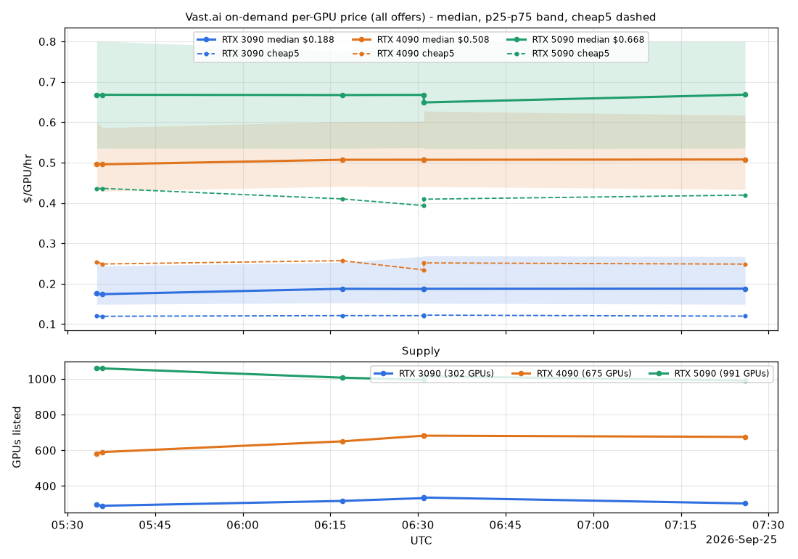

# vast-price-tracker

Hourly snapshot of Vast.ai **on-demand, rentable** offers for RTX 3090, RTX 4090 and RTX 5090.
Prices are **per GPU** (`dph_total / num_gpus`). Each run stores, per GPU and per subset
(`all` offers, `reliable` = reliability2 >= 0.98): offer count, GPU count (supply), min, p10, p25,
median, p75, p90, mean, `cheap5` (mean of the 5 cheapest), and a GPU-weighted median.



## Files

| File | What |
|---|---|
| `collect.py` | Queries the Vast search API (stdlib only; API key from env `VAST_API_KEY`, else `~/.config/vastai/vast_api_key`), appends 6 rows (plus the card rows, below) to `data/prices.csv`, logs one line to `data/collect.log`, keeps a raw per-offer snapshot in `data/raw/` (local only, gitignored). All-or-nothing: if any GPU query fails, nothing is written and it exits 2. |
| `cards.json` | Tracked cards and a snapshot of the dashboard's local search state (see below). Read by `collect.py`. |
| `sync_cards.py` | Local only (PyYAML + the sibling repos). Rewrites `cards.json` from the card.yml files and the dashboard's `data/` files. |
| `chart.py` | Renders `chart.html` (interactive) and `chart.png` (static, `all` subset). Card subsets are ignored here; the dashboard's GPU Prices tab shows them. |
| `run.cmd` | Runs collect then chart; output appended to `data/run.log`. |
| `install_task.ps1` / `uninstall_task.ps1` | Windows Scheduled Task on/off. Optional fallback only; not installed. |
| `.github/workflows/collect.yml` | The collector: hourly job on GitHub Actions. |

## Per-card subsets (`cards.json`, `sync_cards.py`)

For each card in `cards.json`, `collect.py` runs the **same search the dashboard's Offers /
Offers-Auto pages run for that card** (vastai-api-manager `search_card_offers`, default page
state: card max_price / min_disk_gb / min_download_speed, Secure off, preferred GPU types on,
verified per card or settings, favorites passed, blocked hidden). One API query per card, over
every GPU type the card lists. It writes subset `card:<name>` rows: one per GPU type, plus one with
gpu `ALL` over every matching offer. A GPU type with no match still gets a row with `n_offers` 0
and empty prices. The card queries are part of the all-or-nothing run: if one fails, nothing is written.

What is mirrored: the query body `search_offers` builds (including its quirks, e.g. min_vram_gb goes
to the server unscaled and is re-checked in MB client-side); the box-profile gates
(`min_cuda_max_good`, `require_avx`); single-GPU offers only; `dph_total <= max_price`; up/down
speed floors; the per-GPU column cap (`column_cap_broad`, cheapest first); favorite and fast-machine
offers that bypass max_price and the cap; the blocklist; the pre-AVX2 CPU screen and machine
denylist; and the host-viability gate (cuda_max_good, has_avx, gpu_types, cpu_ram/gpu_ram in MB,
inet, reliability2). Offers missing a field are kept, as in the dashboard.

Not mirrored, because it is runtime state on the laptop: the anti-phantom ask-table swap, the
dead-offer / dead-machine caches, the soft blocklist (`launch_outcomes.json`, 6 h window), and
`min_cpu_features` (no tracked card uses it; `sync_cards.py` warns if one does).

Vast returns a different mix of machines for identical back-to-back queries (about a quarter
change), so treat a single snapshot's `min` as noisy. The dashboard has the same churn.

`cards.json` is generated. To track another card, add it (or refresh after editing a card or the
dashboard's blocklist/favorites) and commit:

```
python sync_cards.py <card-name> [<card-name> ...]   # adds to "tracked" and refreshes all
python sync_cards.py                                  # refresh everything already tracked
```

It snapshots these laptop-only inputs so Actions applies them too: each card's `gpu_requirements`
(`comfyui-projects/*/cards/<name>/card.yml`), the active box profile's gates
(`data/box_profiles.json`), `verified_default` / `exclude_external` / `broad_fetch_limit`
(`data/settings.json`), blocklist machine+host ids (`data/blocklist.json`), favorite machine+host
ids (`data/favorites.json`), fast-machine ids (`data/fast_machines.json`), and the provider's
hard-coded machine denylist. Only ids are copied, never notes. `column_cap_broad` is read from
`settings.json` too when present (default 100).

## Viewing

Open `chart.html` in a browser. Toggle all/reliable, pick 24h / 7d / 30d / all. The top panel is
median $/GPU/hr with a p25-p75 band and a dashed cheap5 line; the bottom panel is supply (GPUs listed).
The page loads Chart.js from cdn.jsdelivr.net, so it needs internet (see the VPN note below).
`chart.png` is the offline/phone view.

## Local schedule (Windows) - fallback, not in use

GitHub Actions is the only collector. The laptop Scheduled Task was uninstalled (2026-09-25);
do not install it while Actions is running, or both will append rows and duplicate the series.
The instructions below are kept only as a fallback if Actions is ever retired.

```
powershell -ExecutionPolicy Bypass -File install_task.ps1
```

Registers `VastPriceTracker`: hourly at :17, current user, runs on battery, catches up after sleep
(StartWhenAvailable), no console window (`conhost --headless`). Re-running it replaces the task.
Remove with `uninstall_task.ps1`. Needs `python` (with matplotlib) on PATH.

**VPN gap:** on the GlobalProtect VPN, DNS cannot resolve `console.vast.ai`. Those runs log
`network/DNS unavailable - skipped`, exit 2 and write no row, so the series simply has holes
while the VPN is up (and while the laptop is off). The charts still re-render.

## GitHub Actions (the collector)

1. The workflow runs hourly at :17 UTC (plus a manual "Run workflow" button), and commits
   `data/prices.csv`, `data/collect.log`, `chart.html` and `chart.png` when they change.
2. It needs the repo secret **`VAST_API_KEY`**: a restricted, search-only Vast API key, passed to
   `collect.py` as an env var. Without a key Vast caps search results at **64 offers**, so the
   stats would describe a truncated sample. A keyless run logs a `WARN`; if any GPU comes back with
   exactly 64 offers it logs `SKIP unauthenticated result capped at 64`, writes no rows and exits 2.
3. The local Scheduled Task is not used; `git pull` to get the latest data and chart.

GitHub's scheduled runs can be delayed by several minutes.

## Test-only override

`VPT_RESOLVE=<ip>` makes `console.vast.ai` resolve to that IP (TLS still uses the real hostname).
It is only for manual testing on a broken resolver and is never set by the scheduled runs.
